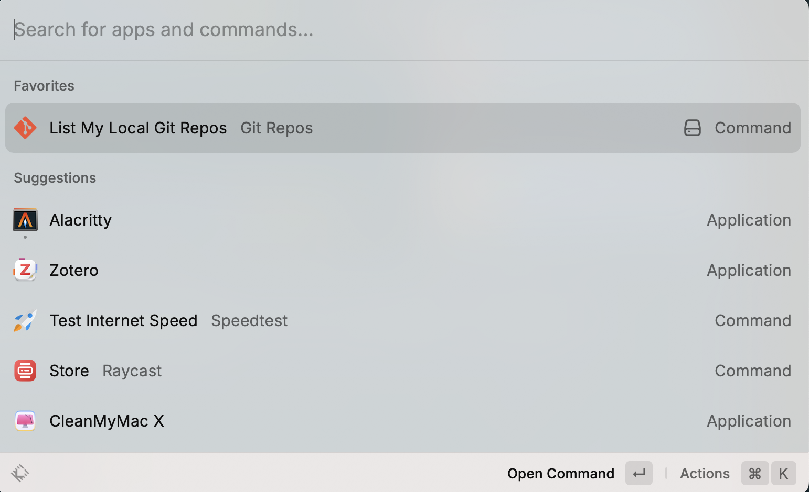

# Local Git Repos

This raycast extension is created from [git-repos](https://github.com/raycast/extensions/tree/main/extensions/git-repos), and add some additional features:

1. Show git status of repo with inline tag
2. Show clear status details on detail window
3. Toggle detail to review git repo state

## Installation
- Clone the repository.
- Install dependencies with `npm install`.
- Build the extension with `npm run build`.
- Open the extension with Raycast.

## Setup
1. Enter your local git repository paths on configuration (separate with :)
2. Set commonly-used Terminal Emulator like iTerm2 (default to Terminal)

## Usage
Entrance: 

---
Main View: 

    

---
You can hit `Enter` to toggle status details in right window: 

---
Or do some actions on that repository, like copy repo path and go to terminal, or open it in github: 

## License
[MIT](LICENSE.txt)

